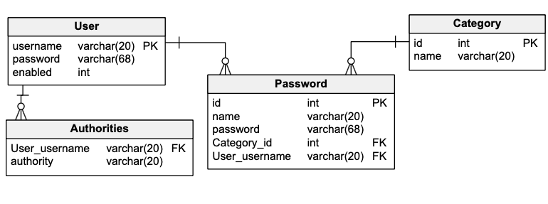

# Password Manager
> Project is web app based on CRUD methods. Backend was written in Java and Spring. REST API was prepared for possible improvement this project in future.  Frontend was made in Thymeleaf. Project of database was created with using best practices, become normalised and implement relations One-To-Many and Many-To-One. Database was implemented in MySql. Password manager gives us opportunities to managing our passwords. Admin has opportunity to manage all passwords and users. App was written with Clean Code and OOP programming practice. Unit tests were code using JUnit and Mockito.

## Table of Contents
* [General Info](#general-information)
* [Technologies Used](#technologies-used)
* [Database](#database)
* [Screenshots](#screenshots)
* [Login](#login)
* [Project Status](#project-status)
* [Room for Improvement](#room-for-improvement)
* [Contact](#contact)

## General Information
- Password manager gives us oppurtunity to adding, deleting, editing and searching passwords, earlier added to database. Passwrods are encoding in database. Data are validated and passwords are verificated to being safe enough. There is also implemented algorithm to generate safe passwords. Administrator account additionaly let us to create categories and users, and searching every password saved in database.
- Project goal is improvement my programming skills and show my ability to write good quality code.
- Project with similiar requirements, On my PJC classes, I have to do project with similar requirements (in C++, https://github.com/KubaTworek/PasswordManager) but I decided to build it also as WebApp in Java with using some frameworks.

## Technologies Used
- Java
- SpringBoot
- SpringSecurity
- Hibernate
- Thymeleaf, HTML, CSS, Bootstrap
- MySQL, JSON

## Database

<!-- If you have screenshots you'd like to share, include them here. -->
  
  
## Screenshots

<!-- If you have screenshots you'd like to share, include them here. -->

## Login
* To login as administrator use: login->admin password->admin
* To login as user use: login->user password->user

## Project Status
Project is: _complete_
- Despite project is complete, I am still working to improve code or adding new features, also in the future I hope I will add frontend made in Angular

## Room for Improvement

Room for improvement:
- Improve getting thing from database
- Improve code quality
- Delete useless methods
- Add frontend build in Angular

To do:
- Add algorithm generating safe passwords
- Validate values method
- Add specific exceptions

## Contact
Created by me :)
